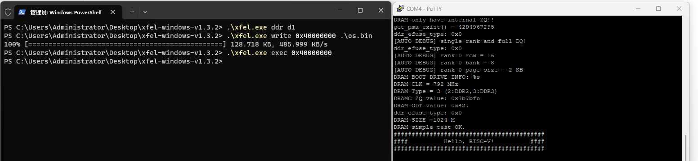

## Hello-D1

这是一个简单的hello程序，可以在LicheeRV Dock开发板裸机环境下运行。它的功能很简单：向uart输出“hello，world”。

代码实现参考自 [第7章 Hello RVOS_哔哩哔哩_bilibili](https://www.bilibili.com/video/BV1Q5411w7z5/?p=16&vd_source=d7b8f428791733397f523f73270a2c9b) 和 [xfel/payloads/d1_f133/d1-ddr/source/sys-uart.c ](https://github.com/xboot/xfel/blob/master/payloads/d1_f133/d1-ddr/source/sys-uart.c)

### 编译方式

在Ubuntu 20.04环境下，可以直接使用官方的GNU工具链，执行以下命令安装并编译：

```shell
$ sudo apt update
$ sudo apt install build-essential gcc make perl dkms git gcc-riscv64-unknown-elf gdb-multiarch
$ make
```

### Blog

[1、uart串口通信.md](./doc/1、uart串口通信.md)

[2、程序的移植和运行.md](./doc/2、程序的移植和运行.md)

### 效果

程序借用[xboot/xfel](https://github.com/xboot/xfel/tree/master)工具烧录到开发板的内存中并执行：



左侧为执行命令，右侧程序输出为：

```
###########################################
####        Hello, D1 & RISC-V!        ####
###########################################
```

