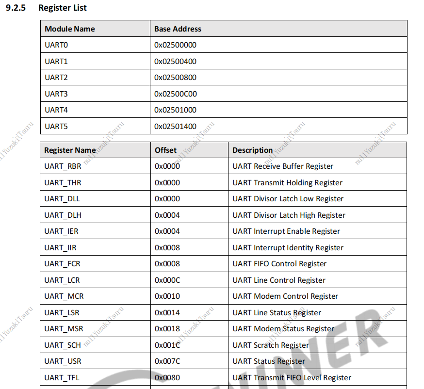

## 串口通信及编程

[toc]

### 什么是UART？

**UART**（Universal Asynchronous Receiver/Transmitter，**通用异步收发传输器**）是一种[异步收发传输器](https://zh.wikipedia.org/wiki/异步串行通信)，是[电脑硬件](https://zh.wikipedia.org/wiki/电脑硬件)的一部分，将数据通过[串列通信](https://zh.wikipedia.org/wiki/串列通訊)进行传输。显示屏上的COM接口中也存在UART引脚（右图）：


上图右侧可以看到pin2和pin3分为RXD和TXD引脚，数据正式通过这两个接口发送的，其他引脚则用于状态的控制和检测。不过这类接口现在并不常用了，在笔记本上也逐渐被HDMI接口代替。

在D1开发板上虽然只提供了HDMI接口而没有提供串口接口，但它提供了40个引脚，其中包括了用于UART的RX和TX引脚，并在背面标注了位置：


于是，我们可以针对这两个引脚编程进行串口通信。（实际上，这个项目中只涉及字符串从开发板到显示器的单向传输过程，所以在开发板上，实际上只有TX引脚上有数据的传输）

### 向UART写数据

在这个项目中，我们需要通过UART引脚向显示器输出"hello, world"，为此我们需要了解如何向UART写入数据，先给出对应的C语言代码：

```c
// code for write uart
typedef unsigned int u32_t;
typedef unsigned long long addr_t;

static void write32(addr_t addr, u32_t value)
{
	*((volatile u32_t *)(addr)) = value;
}

void sys_uart_putc(char ch)
{
	addr_t addr = 0x02500000;

	while((read32(addr + 0x7c) & (0x1 << 1)) == 0);
	write32(addr + 0x00, ch);
}
```

在这段代码中，我们向地址`0x02500000`处写入字符`ch`。那么地址`0x02500000`表示的是什么呢？查阅D1芯片手册，在UART章节中有这样两个表格：



第一个表格中表明D1芯片包含6块UART地址，每个地址的空间大小为400bit，这六块地址相互独立，也就是说我们最多可以连接六个使用UART进行数据传输的外部设备。

第二个表格中表明每块UART空间中存在多个寄存器，它们有不同的用处，比如在`0x25000000`地址偏移值为`0x0000`处有三个寄存器：`UART_RBR`、`UART_THR`和`UART_DLL`寄存器，这三个寄存器复用同一块地址。那么这些寄存器具体作用是什么呢？

往后翻有每个寄存器的介绍，找到相关介绍：


在这三个寄存器中，高24bit（8:31位）没有作用，低8bit（0:7位）有各自的用途，根据描述得到下面的信息：

+ `UART_RBR`用于数据的接收；
+ `UART_THR`用于输出的发送，但仅当`UART_LSR[5]`被设置时数据才会被写入`UART_THR`；当FIFO模式
+ `UART_DLL`用于设置波特率，仅当`UART_LCR[7]`被设置并且`UART_USR[0]`为0时才有效；当`UART_DLL`和`UART_DLH`同时设置为0时，波特率时钟将禁用，不会有任何通信发生。

因为我们只关心数据从开发板到显示屏的单向传输，所以重点放在`UART_THR`和`UART_DLL`两个寄存器上。

在给出的第一段代码中，`write32(addr + 0x00, ch);`的作用是向`UART_THR`写入数据，这些数据将通过UART引脚传输到显示器；

在这行代码之前有一条while循环语句：`while((read32(addr + 0x7c) & (0x1 << 1)) == 0);`，它用于判断偏移地址为`0x7c`处的寄存器第二位的数据是否为0。偏移地址为`0x7c`处的寄存器是`UART_USR`寄存器，它的作用是什么呢？继续翻阅D1芯片手册：


在这个寄存器中，第二位用于判断读写是否已满，因为是串口通信，并且读写使用的寄存器`UART_RBR`和`UART_THR`复用了同一块地址，所以读和写要排队进行（串行也就是这个意思），通过`UART_USR[1]`可以判断前面一次读写操作是否完成。

`while((read32(addr + 0x7c) & (0x1 << 1)) == 0);`的作用就是读写未完成时（`UART_USR[1]`=1）阻塞读写操作；当上一次读写完成后，终止循环，进行下一次读写。

### 设置UART波特率

串口线连接着两个设备，信息以固定速度的比特流形式进行传输，在传输前，需要约定好比特率的传输速度，也就是波特率。否则两边收发的时钟不一致，导致传出错误（数据或许还是可以到达另一端，但接收方得到的不是原始数据）。

由于这里用putty工具来获取从uart传输的数据，所以在主机一侧，我们可以在putty中设置比特率：


在这里比特率设置为115200 baud，即每秒可以传输115200个比特，串口线为COM5（可以在 设备管理器》串口 中确定）。

主机显示这一侧设置好了，现在需要设置的就是开发板这一侧的波特率了。前面有说到`UART_DLL`寄存器用于设置波特率，为使其生效，需要设置`UART_LCR[7]`，同时`UART_USR[0]`为0（上一次读写完成）。`UART_LCR[7]`需要手动设置，`UART_USR[0]`则在IO完成自动更新。从D1芯片手册中找到`UART_LCR`寄存器的偏移地址分别为`0x000c`。

重复上一节的方式，翻阅手册去了解相关寄存器的设置，得到如下代码用于设置波特率和每次传输的比特长度：

```c
	addr = 0x02500000;	// 第0块UART的起始地址

	// 在默认情况下，0x04处为UART_IER寄存器，将其设置为0以关闭中断
	write32(addr + 0x04, 0x0);  
	
	// 将0x0c的UART_LCR第8位设置位1，其他位保持不变，0x00被选为UART_DLL寄存器，0x04被选为UART_DLH寄存器
	val = read32(addr + 0x0c);
	val |= (1 << 7);
	write32(addr + 0x0c, val);
	// 设置0x00的UART_DLL为0x0d，即13，对应波特率为115200
	write32(addr + 0x00, 0x0d);
	// 设置0x04的UART_DLM为0x00，即将波特率的高8位设置位0
	write32(addr + 0x04, 0x00);

	// 将0x0c的UART_LCR第8位设置位0，0x00被选为UART_RBR/UART_THR，0x04处被选为UART_IER
	val = read32(addr + 0x0c);
	val &= ~(1 << 7);
	write32(addr + 0x0c, val);
	
	// 保持0x0c的UART_LCR高2:31位不变，将低2位设置为11，表示数据长度为8bit
	val = read32(addr + 0x0c);
	val &= ~0x02;
	val |= 0x3;
	write32(addr + 0x0c, val);
```

上面所有这些设置都可以在D1芯片手册中找到，就是过程挺麻烦的qwq。


