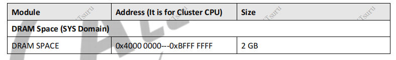
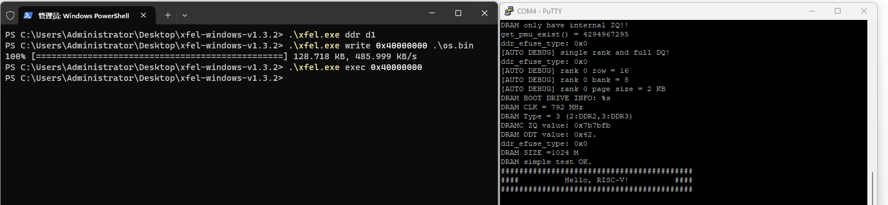

## 在D1芯片上运行程序

- [在D1芯片上运行程序](#在d1芯片上运行程序)
  - [程序地址空间](#程序地址空间)
  - [RISC-V32转RISC-V64](#risc-v32转risc-v64)
  - [程序的烧录和运行](#程序的烧录和运行)


### 程序地址空间

在上一篇blog中记录了串口通信的方式，这解决了字符串的显示问题。但还有别的问题：程序在内存中运行，在有操作系统的情况下，我们可以采用虚拟地址，起始地址为0；但没有操作系统的情况下，我们需要直接和物理地址打交道，而物理地址并非全部用于内存，比如上一篇blog中UART对应的地址为0x02500000处1Kb的空间，有6块，加起来共6kb。那么用于内存的区域是哪一块地址呢？

继续查阅D1芯片手册：



可以看到内存DRAM的地址空间为0x40000000到0xBFFFFFFF处的2GB空间，我们的程序需要存放到内存中，同时向内存读写数据时起始地址需设置为0x40000000，这可以在编译时指定`-Ttext=0x40000000`来完成。

### RISC-V32转RISC-V64

这个项目以 [第7章 Hello RVOS_哔哩哔哩_bilibili](https://www.bilibili.com/video/BV1Q5411w7z5/?p=16&vd_source=d7b8f428791733397f523f73270a2c9b) 基础上进行修改，而该项目是risc-v32的，在编译后指令长度为32，而D1芯片是64位的，因此在编译时我们需要改用64位编译方式。于是将`common.mk`中的相关配置改为64就好了：

```makefile
CROSS_COMPILE = riscv64-unknown-elf-
CFLAGS = -nostdlib -fno-builtin -march=rv64ima -mabi=lp64 -mcmodel=medany -g -Wall

QEMU = qemu-system-riscv64
QFLAGS = -nographic -smp 1 -machine virt -bios none

GDB = gdb-multiarch
CC = ${CROSS_COMPILE}gcc
OBJCOPY = ${CROSS_COMPILE}objcopy
OBJDUMP = ${CROSS_COMPILE}objdump
```

注意，如果你的程序超过2GB，比如指定的程序起始地址为`-Ttext=0x80000000`，这个地址离内存起始地址`0x40000000`超过2GB。此时需要指定`-mcmodel=medany`参数，否则编译时可能出现如下错误：

```console
$ make 
riscv64-unknown-elf-gcc -nostdlib -fno-builtin -march=rv64ima -mabi=lp64 -g -Wall -c -o start.o start.S
riscv64-unknown-elf-gcc -nostdlib -fno-builtin -march=rv64ima -mabi=lp64 -g -Wall -c -o kernel.o kernel.c
riscv64-unknown-elf-gcc -nostdlib -fno-builtin -march=rv64ima -mabi=lp64 -g -Wall -c -o sys_uart.o sys_uart.c
riscv64-unknown-elf-gcc -nostdlib -fno-builtin -march=rv64ima -mabi=lp64 -g -Wall -Ttext=0x80000000 -o os.elf start.o kernel.o sys_uart.o
kernel.o: in function `start_kernel':
/workspaces/riscv-operating-system-mooc/code/os/01-helloRVOS/kernel.c:7:(.text+0x18): relocation truncated to fit: R_RISCV_HI20 against `.LC0'
collect2: error: ld returned 1 exit status
make: *** [Makefile:18: os.elf] Error 1
```

### 程序的烧录和运行
在运行make命令正常编译后得到bin文件和elf文件，其中bin文件为纯指令，而elf文件中则有特定的格式信息，可以通过linux中的objdump等工具查看其中的符号信息，这里我们需要烧录的是纯指令的bin文件。

运行使用的是[xboot/xfel](https://github.com/xboot/xfel/tree/master)工具，该工具将编译好的程序烧录到开发板的内存中，无需考虑程序从磁盘的加载过程（qemu也是如此）；在使用该程序前需安装[WinUSB]((https://zadig.akeo.ie/))驱动。安装完成后可进行烧录测试，得到如下结果：



注意，使用这种方式只能进行一次测试，再次测试时会出现”[usb bulk send error](https://github.com/xboot/xfel/issues/56#issuecomment-1782238115)“的错误，需按住fel键重新上电即可再次测试。


